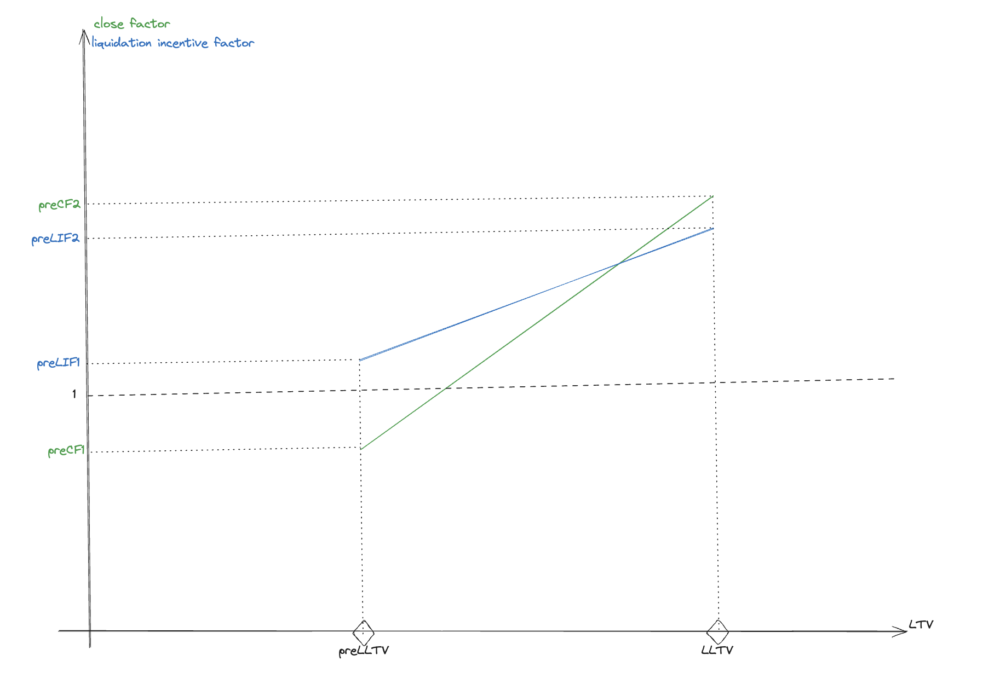

# PreLiquidation
## Overview

The PreLiquidation is a set of contracts developed on top of Morpho on which borrowers can enable pre-liquidations, a liquidation with better guarantees (e.g., lower bonus given to the liquidator or partial liquidation).
There are two distinct type of contracts in this project.
- PreLiquidationFactory whose role is to deploy various PreLiquidation contracts each with its own preliquidation settings.
- PreLiquidation whose role it to be the endpoint for preliquidation according to an immutable preliquidation settings. Borrowers can consent to preliquidation by authorizing the preliquidation contract on Morpho. Liquidators can preliquidate a position by calling `preLiquidate` on a preliquidation contract.

A preliquidation setting is composed of
- a morpho market (given by its Id)
- a pre-liquidation-loan-to-value (prelltv)
- two pre-liquidation close factor parameters (preCF1 and preCF2)
- two pre-liquidation incentive factor parameters (preLIF1 and preLIF2)
- a pre-liquidation oracle

### How is the pre-liquidation close factor and pre-liquidation incentive factor computed ?
The pre-liquidation close factor and the pre-liquidation incentive factor evolve dynamically (and even linearly) according to the user health. The close factor is preCF1 when the position LTV equals preLLTV and preCF2 when it equals LLTV whereas the liquidation incentive factor is preLIF1 at LTV=preLLTV and preLIF2 at LTV=LLTV.
This computation is represented in the following graph

## Getting started
### Package installation
Install [Foundry](https://book.getfoundry.sh/getting-started/installation)

### Run tests
Run `forge test`

### Deploy a PreLiquidation contract
If no factory has been deployed yet, it's possible to deploy one using

`forge create src/PreLiquidationFactory.sol:PreLiquidationFactory --constructor-args <MORPHO_ADDRESS> --interactive --rpc-url <RPC_PROVIDER_URL>`

Then a PreLiquidation contract can be deployed using

`cast send <FACTORY_ADDRESS> "createPreLiquidation(bytes32,(uint256,uint256,uint256,uint256,uint256,address))" --rpc-url <RPC_PROVIDER_URL> --interactive <MARKET_ID> <PRE_LLTV> <PRE_CF_1> <PRE_CF_2> <PRE_LIF_1> <PRE_LIF_2> <PRE_ORACLE_ADDRESS>`

## Audits
All audits are stored in the `audits` folder.

## License
PreLiquidation is licensed under `GPL-2.0-or-later`, see [`LICENSE`](./LICENSE).
