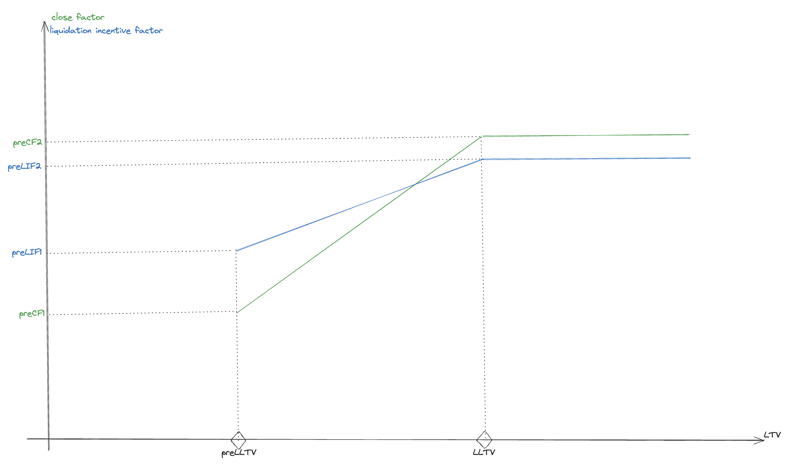

# PreLiquidation
## Overview

This project puts together different contracts to carry out liquidations on Morpho with specific parameters chosen by the borrower. We call these user-defined Morpho Blue transactions pre-liquidations. For example, a user can authorize pre-liquidations where a lower bonus is given to the liquidator or where only a part of the debt is allowed to be repaid.

There are two distinct types of contracts in this project.

- PreLiquidation whose role it to be the endpoint for pre-liquidation according to an immutable pre-liquidation settings. Borrowers can consent to pre-liquidation by authorizing the pre-liquidation contract on Morpho. Liquidators can preliquidate a position by calling `preLiquidate` on a pre-liquidation contract.
- PreLiquidationFactory whose role is to deploy various PreLiquidation contracts each with its own pre-liquidation parameters.

A pre-liquidation setting is composed of
- a Morpho market (`id`)
- a pre-liquidation loan-to-value (`preLltv`)
- two pre-liquidation close factor parameters (`preCF1` and `preCF2`)
- two pre-liquidation incentive factor parameters (`preLIF1` and `preLIF2`)
- a pre-liquidation oracle (`preLiquidationOracle`)

### Pre-liquidation close factor and incentive factor
The pre-liquidation close factor and the pre-liquidation incentive factor evolve linearly with the user's LTV:
- the close factor is `preCF1` when the position LTV equals `preLLTV` and `preCF2` when it equals `LLTV`
- the liquidation incentive factor is `preLIF1` when the position LTV equals `preLLTV` and `preLIF2` shen it equals `LLTV`

This computation is represented in the Figure 1.

This design enable different many pre-liquidation settings, the two main use-cases being:
1. Using normal fixed parameters when `preLIF1 = preLIF2` and `preCF1 = preCF2`.
2. Using health dependent dutch auction style liquidation (as implemented by Euler) when either `preLIF1 < preLIF2` or `preCF1 < preCF2`.

## Getting started
### Package installation
Install [Foundry](https://book.getfoundry.sh/getting-started/installation)

### Run tests
Run `forge test`

## Audits
All audits are stored in the `audits` folder.

## License
The source code in this repository is publicly available under licens `GPL-2.0-or-later`, see [`LICENSE`](./LICENSE).
